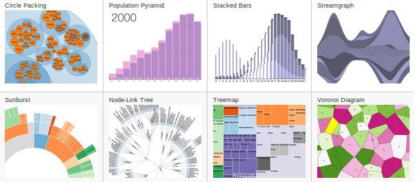
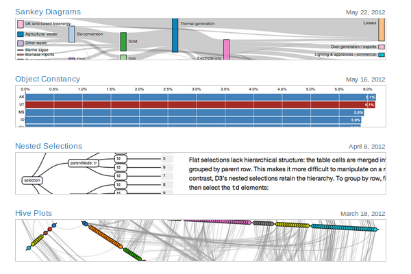
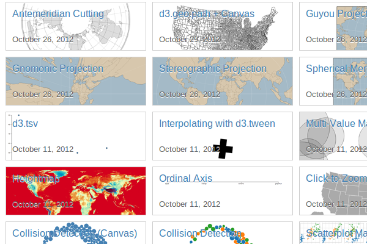
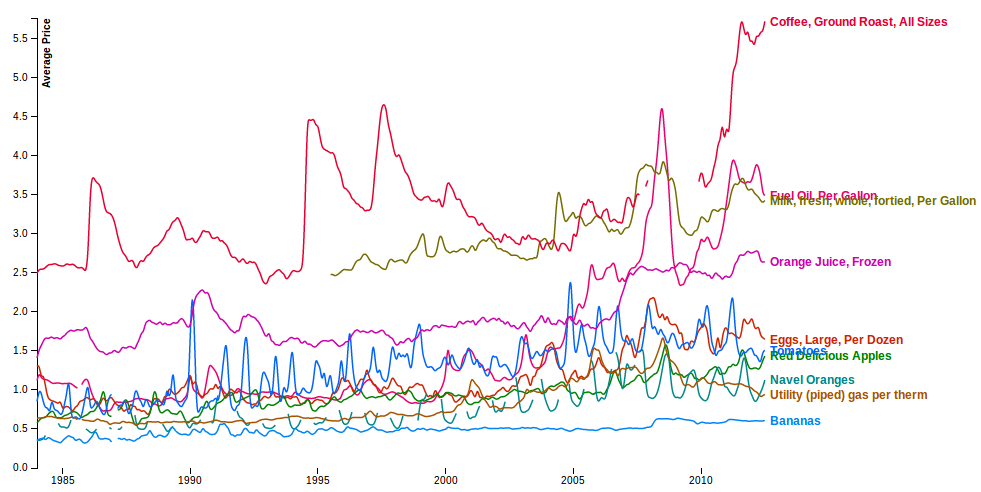
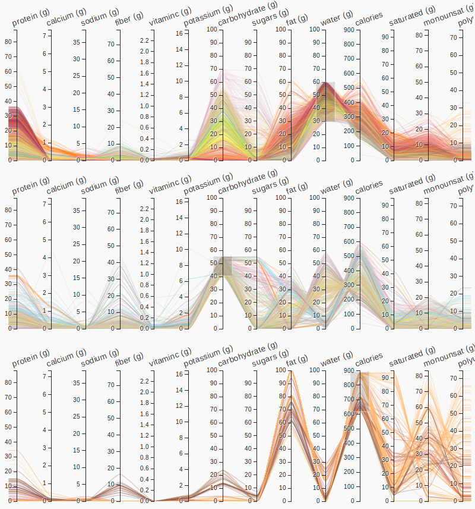
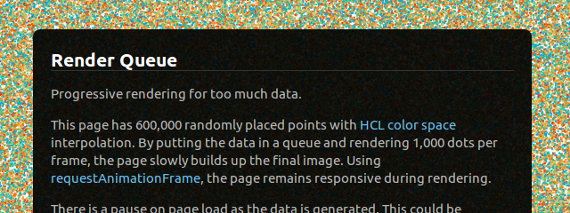
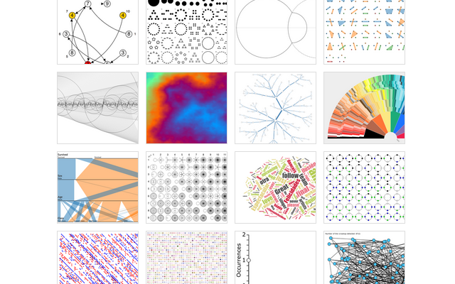
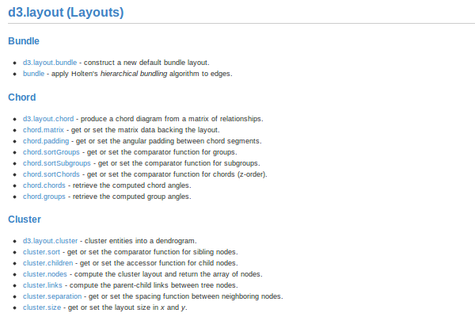

# Intro to D3.js

This class is an introduction to [Data-Driven Documents](http://d3js.org), a javascript library for web visualization by [Mike Bostock](http://bost.ocks.org/mike).

#### Visual Example Gallery

#### Mike Bostock

#### mbostock's [bl.ocks](http://bl.ocks.org)

### Class Outline

* What is D3?
* What is data? What is a document?
* How do I learn to make a basic chart?
* How do I stay up-to-date with the latest changes to D3?

A basic to intermediate understanding of HTML and JavaScript is required to get the most out of this class. This class will cover advanced material in a flexible, discussion-oriented format. Participants are expected to have some prior knowledge of Javascript. Since D3 uses advanced JavaScript and HTML5 techniques, we may get into fairly technical discussions based on the interest and questions of those participating. 

### Class structure

* *0:00-0:15* Introduction
* *0:15-0:30* Learning resources
* *0:15-0:45* Concepts for web visualization
* *0:45-1:30* Coding Exercise
* *1:30-2:00* Discussion

### Stuff I've done with d3

Various examples on [Expose Data](http://exposedata.com/) and [bl.ocks.org](http://bl.ocks.org/syntagmatic).

#### Average Prices

#### Julia Set

#### Parallel Coordinates 

Also check out the [library](http://syntagmatic.github.com/parallel-coordinates) I'm working on.

#### Render Queue

### Motion Charts

D3.js puts a lot of effort into working with data-driven transitions. Why?

Check out this video by Hans Rosling on data storytelling with statistical graphics. There's even a [version of this chart](http://bost.ocks.org/mike/nations/) by Mike Bostock in D3.

<iframe width="640" height="360" src="http://www.youtube.com/embed/jbkSRLYSojo" frameborder="0" allowfullscreen></iframe>

### Dot Enter Mixtapes and Tributary

Want to learn D3 in 30 minutes? Check out these [screencasts](http://vimeo.com/search?q=enjalot) and follow along with the live editor [Tributary](http://enjalot.com/)

<iframe src="http://player.vimeo.com/video/49741435?portrait=0&amp;badge=0" width="640" height="400" frameborder="0" webkitAllowFullScreen mozallowfullscreen allowFullScreen></iframe>

### Basic Charts

These charts provide examples of creating a basic chart with an external data file in [CSV](http://en.wikipedia.org/wiki/Comma-separated_values) and TSV formats.

* Loading and parsing data
* Creating quantitative scales
* Visualizing data
* Creating axes
* Transitioning data with animation

#### Examples

* [Area Chart](http://bl.ocks.org/3883195)
* [Line Chart](http://bl.ocks.org/3883245)
* [Multi-Series Line Chart](http://bl.ocks.org/3884955)
* [Stacked Area Chart](http://bl.ocks.org/3885211)
* [Bar Chart](http://bl.ocks.org/3885304)
* [Stacked Bar Chart](http://bl.ocks.org/3886208)
* [Normalized Stacked Bar Chart](http://bl.ocks.org/3886394)
* [Grouped Bar Chart](http://bl.ocks.org/3887051)
* [Scatterplot](http://bl.ocks.org/3887118)
* [Scatterplot with Dimension Dropdowns](http://bl.ocks.org/d/3201160/)
* [Donut Chart](http://bl.ocks.org/3887193)
* [Pie Chart](http://bl.ocks.org/3887235)
* [Donut Multiples](http://bl.ocks.org/3888852)
* [Bar Chart with Negative Values](http://bl.ocks.org/2368837)

Find more examples in the [wiki gallery](https://github.com/mbostock/d3/wiki/Gallery) and [Mike's bl.ocks](http://bl.ocks.org/mbostock).

### Mathematical Visualization

### API Reference

The definitive guide to D3.

### Compatability

* [Canvas](http://caniuse.com/canvas)
* [SVG](http://caniuse.com/svg)
* [WebGL](http://caniuse.com/webgl)

### Color

* [CSS Colors](http://www.w3schools.com/cssref/css_colors.asp)
* [Guide to CSS Colors](http://sixrevisions.com/css/colors-webdesign/)
* [Adobe Kuler](http://kuler.adobe.com/)
* [Chroma.js](https://github.com/gka/chroma.js)

<a href="http://vis4.net/blog/posts/avoid-equidistant-hsv-colors/"></img></a>

### More Resources

* [d3.js](http://d3js.org/)
* [Mailing List](https://groups.google.com/group/d3-js)
* [Tutorials and Talks](https://github.com/mbostock/d3/wiki/Tutorials)
* [Scott Murray's D3 Tutorials](http://alignedleft.com/tutorials/d3/)
* [Ian Johnson's Intro Materials](http://enjalot.github.com/intro-d3)
* [MDN SVG Tutorial](https://developer.mozilla.org/en/SVG)

#### d3.v3

It's [coming](https://github.com/mbostock/d3/wiki/Release-Notes)

### Other Useful Libraries 

* [Underscore.js](http://underscorejs.org/)
* [Backbone.js](http://backbonejs.org/)
* [Underscore String](http://epeli.github.com/underscore.string/)
* [Underscore Math](https://github.com/syntagmatic/underscore.math/blob/master/underscore.math.js)
* [Miso Dataset](http://misoproject.com/dataset/)
* [Miso Storyboard](http://misoproject.com/dataset/)

### Other Visualization Libraries

* [Raphael](http://raphaeljs.com/)
* [ggplot2](http://ggplot2.org/)
* [Processing.js](http://processingjs.org/)
* [three.js](http://mrdoob.github.com/three.js/)

### Data Tools

* [GoogleRefine/OpenRefine](http://code.google.com/p/google-refine/)
* [Python](http://en.wikipedia.org/wiki/Python_\(programming_language\))
* [R](http://en.wikipedia.org/wiki/R_\(programming_language\))
* [LibreOffice](http://www.libreoffice.org/)
* [Postgres](http://www.postgresql.org/)

### Data

* [Gravesites of US Veterans](https://explore.data.gov/catalog/raw?q=gravesite&sortBy=last_modified) - [Wyoming in parallel coordinates](http://syntagmatic.github.com/parallel-coordinates/examples/veterans.html)
